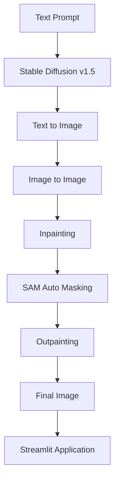

# 🎨 AI Image Studio with Stable Diffusion

<div align="center">


**End-to-End Generative AI Project using Stable Diffusion, Inpainting, Outpainting, and Segment Anything Model (SAM).**

</div>

---

## 🚀 Project Overview

This project demonstrates the implementation of modern image generation techniques using **Stable Diffusion v1.5** and the Hugging Face Diffusers ecosystem.

The project covers the complete workflow of AI-powered image generation, starting from text prompts and extending to image editing, object replacement, automatic masking, and canvas expansion.

In addition, a Streamlit-based application was developed to provide an interactive interface for image generation and editing.

---

## ✨ Key Features

### 🖼️ Text-to-Image Generation

- Stable Diffusion v1.5
- Positive Prompt Engineering
- Negative Prompt Optimization
- Reproducible Results using Seed Control

### ⚙️ Hyperparameter Exploration

- Guidance Scale (CFG Scale)
- Number of Inference Steps
- Random Seed Selection

### 🔄 Scheduler Comparison

- Euler A
- DPM Solver++
- DDIM

### 🖌️ Image-to-Image Refinement

Transform an existing image into a new variation while preserving its structure.

### 🎯 Inpainting

Replace or modify selected image regions using prompts.

### 🤖 Automatic Masking with SAM

Automatic object segmentation before inpainting.

### 🌌 Outpainting

Expand image boundaries beyond the original canvas.

---

## 🏗️ Project Architecture



---

## 🛠️ Tech Stack

### Core AI Models

- Stable Diffusion v1.5
- Stable Diffusion Inpainting Pipeline
- Segment Anything Model (SAM)

### Libraries

- PyTorch
- Hugging Face Diffusers
- Transformers
- Accelerate
- OpenCV
- NumPy
- Matplotlib
- PIL
- Streamlit

---

## 📂 Repository Structure

```text
.
├── Pipeline_submission_BFGAI_AriefWicaksono.ipynb
├── Streamlit_submission_BFGAI_AriefWicaksono.ipynb
├── app.py
├── logic.py
├── assets/
└── README.md
```

---

## 📊 Experiments Conducted

### Guidance Scale Analysis

- CFG Scale = 3
- CFG Scale = 7.5
- CFG Scale = 12

### Inference Step Analysis

- 10 Steps
- 50 Steps

### Scheduler Benchmark

- Euler A
- DPM Solver++
- DDIM

---

## 💻 Streamlit Application

✅ Generate images from prompts

✅ Select different schedulers

✅ Configure inference parameters

✅ Perform inpainting

✅ Upload custom images

✅ Edit images using masks

---

## 🎯 Learning Outcomes

- Diffusion Models
- Stable Diffusion Pipelines
- Prompt Engineering
- Image Generation Optimization
- Image Editing with AI
- Segmentation Models
- Generative AI Deployment
- Streamlit Application Development

---

## 🚀 Future Improvements

- SDXL Integration
- ControlNet Support
- LoRA Fine-Tuning
- Multi-Image Batch Processing
- Cloud Deployment

---

## 👨‍💻 Author

**Arief Wicaksono**

Generative AI Enthusiast | Machine Learning Engineer

⭐ If you found this project interesting, feel free to give it a star.
